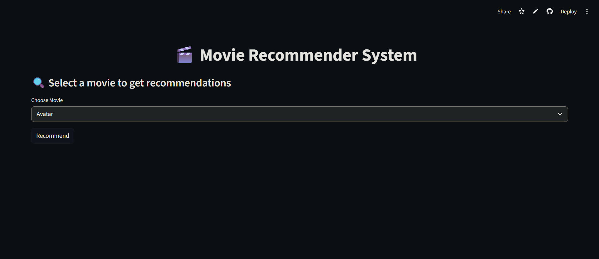
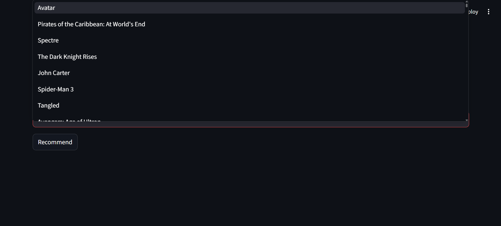
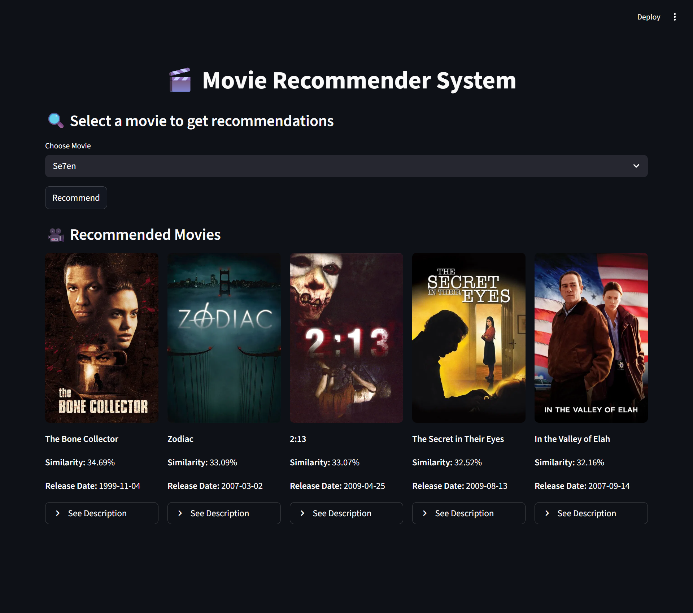

# 🎬 Movie Recommender System

Explore a movie recommender that returns the **top 5 similar titles** with live poster previews.

## Live Demo
[](https://movie-recommender-system-iqko7nhkvwvuoeglp4pwid.streamlit.app/)


## About
This project implements a **Content-Based Filtering** recommender for movies using metadata from TMDB datasets.  
It builds a text representation (Bag of Words) from curated movie tags, transforms them with **`CountVectorizer`**, computes pairwise **Cosine Similarity**, and serves recommendations through a **Streamlit** UI.

The app also integrates the **TMDB API** to fetch poster images for recommended movies at runtime.

## Features
- Recommends **top 5** similar movies for a selected title.
- Uses a precomputed similarity matrix for fast retrieval.
- Fetches movie posters dynamically from TMDB movie endpoint.
- Handles missing poster responses with placeholder fallbacks.
- Interactive Streamlit interface with select box + 5-column recommendation layout.
- Uses Streamlit data caching to avoid repeated model loading.

## Tech Stack


- Python
- Streamlit
- Pandas
- NumPy
- scikit-learn
- Requests
- NLTK

## Screenshots
| Landing Page | Movie Selection |
|---|---|
|  |  |

| Recommendation Results | Recommendation Results (Alt Example) |
|---|---|
|  | .png) |

## How It Works

### 1. Data Preprocessing
- Loads two datasets in the notebook:
  - `tmdb_5000_movies.csv`
  - `tmdb_5000_credits.csv`
- Merges both on `title`.
- Keeps only:
  - `movie_id`, `title`, `overview`, `genres`, `keywords`, `cast`, `crew`
- Drops rows with missing values using `movies.dropna(inplace=True)`.

### 2. Feature Engineering
- Parses JSON-like columns with `ast.literal_eval`.
- `convert(...)` extracts `name` values for:
  - `genres`
  - `keywords`
- `convertCast(...)` extracts the first **3 cast names**.
- `fetch_Director(...)` extracts the first crew member where `job == 'Director'`.
- Splits `overview` into tokens using `.split()`.
- Removes spaces inside tokens (example: `Science Fiction` -> `ScienceFiction`).
- Creates `tags` as:
  - `overview + genres + keywords + cast`

> Note: director (`crew`) is extracted in preprocessing, but the final `tags` field in this notebook combines only `overview`, `genres`, `keywords`, and `cast`.

### 3. Vectorization
- Converts the `tags` text corpus using:
  - `CountVectorizer(max_features=5000, stop_words='english')`
- Applies `fit_transform(...).toarray()`.
- Resulting vector matrix shape in notebook output: **`(4806, 5000)`**.

### 4. Similarity Computation
- Computes pairwise similarity using:
  - `cosine_similarity(vectors)`
- Resulting similarity matrix shape in notebook output: **`(4806, 4806)`**.
- Persists artifacts with pickle:
  - `movies.pkl`
  - `similarity.pkl`

### 5. Recommendation Flow
- App loads artifacts via `@st.cache_data` in `load_data()`.
- On selection:
  - Finds selected movie index.
  - Retrieves its similarity row.
  - Sorts scores in descending order.
  - Skips self-match (`[1:6]`).
  - Returns **5** movie titles.
- For each result, calls TMDB API by `movie_id` to fetch poster URL.

## Project Structure
```text
Movie Recommender System/
├── app.py
├── README.md
├── requirements.txt
├── .gitignore
├── .gitattributes
├── data/
│   ├── tmdb_5000_credits.xls
│   └── tmdb_5000_movies.xls
├── models/
│   ├── movies.pkl
│   └── similarity.pkl
├── notebooks/
│   └── Movie_Recommender_System.ipynb
└── Screenshots/
    ├── screenshot_landing.png.png
    ├── screenshot_selection.png.png
    ├── screenshot_results.png.png
    └── screenshot_results(2).png.png
```

## Installation & Setup

### Prerequisites
- Python 3.9+
- Git
- (Optional but recommended) virtual environment

### Steps
```bash
git clone <YOUR_REPO_URL>
cd "Movie Recommender System"

python -m venv .venv
```

**Windows PowerShell**
```powershell
.venv\Scripts\Activate.ps1
```

```bash
pip install --upgrade pip
pip install -r requirements.txt
```

> Important: `app.py` currently loads `movies.pkl` and `similarity.pkl` from the project root.  
> If your artifacts are inside `models/`, move/copy them to root or update paths in `app.py` before running.

Run the app:
```bash
streamlit run app.py
```

## Configuration
### TMDB API Key
The current `app.py` contains a hardcoded TMDB API key in `fetch_poster(...)`.

For production/security:
- Store the key in Streamlit secrets or environment variables.
- Read it in code at runtime (instead of hardcoding).

Suggested options:

**Streamlit secrets**
```toml
# .streamlit/secrets.toml
TMDB_API_KEY="YOUR_TMDB_API_KEY"
```

**Environment variable (PowerShell)**
```powershell
$env:TMDB_API_KEY="YOUR_TMDB_API_KEY"
```

## Model Artifacts
- `movies.pkl`  
  Pickled DataFrame used at inference time (contains `movie_id`, `title`, `tags`).
- `similarity.pkl`  
  Precomputed cosine similarity matrix used to rank nearest movies quickly.

## Usage
1. Launch the Streamlit app.
2. Select a movie from the dropdown.
3. Click **Recommend**.
4. View the top 5 similar movies with posters.

## Future Improvements
- Move TMDB key handling to secure secrets/env-based config in code.
- Add fuzzy title search and typo-tolerant matching.
- Add filters (genre/year/language) on top of similarity ranking.
- Introduce hybrid recommendations (content + collaborative signals).
- Add evaluation metrics notebook section (precision@k / qualitative checks).
- Add automated tests for data loading and recommendation outputs.

## License
This project is licensed under the **MIT License**.

